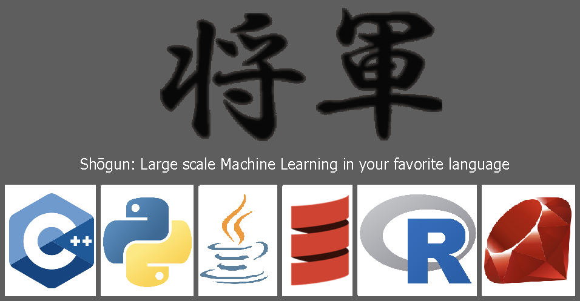
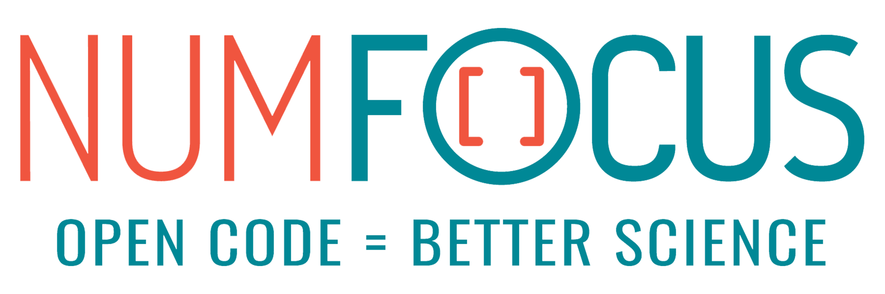
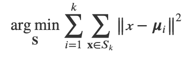
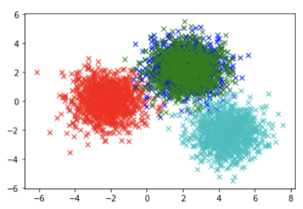
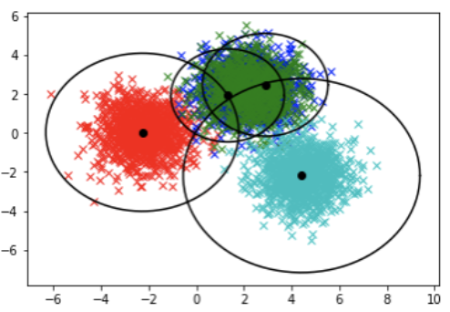

<div align="center">
  <a href="https://shogun.ml">
    
  </a>
  <br>
  <br>

[](https://github.com/shogun-toolbox/shogun/releases/latest)
[](https://anaconda.org/conda-forge/shogun)
[](https://github.com/shogun-toolbox/shogun/issues?q=is%3Aissue+is%3Aopen+label%3A%22good+first+issue%22)
[](https://twitter.com/intent/follow?original_referer=https%3A%2F%2Fwww.shogun.ml%2F&ref_src=twsrc%5Etfw&region=follow_link&screen_name=ShogunML&tw_p=followbutton)
[](http://webchat.freenode.net/?channels=shogun&uio=d4)
[](https://dev.azure.com/shogunml/shogun/_build/latest?definitionId=-1)
[](https://codecov.io/gh/shogun-toolbox/shogun)
[](https://zenodo.org/badge/latestdoi/1555094)
[](https://opensource.org/licenses/BSD-3-Clause)
[](https://numfocus.org/)
[](https://numfocus.salsalabs.org/donate-to-shogun/index.html)

<!--

[](https://pypi.org/project/shogun-ml/)
[](https://mybinder.org/v2/gh/shogun-toolbox/shogun/master)

-->

</div>

# Shogun Machine Learning Toolbox
*Unified and efficient Machine Learning since 1999.*

Shogun is a high-speed **language-agnostic** machine learning library designed for **large-scale problems**. The toolbox contains a number of exclusive state-of-the-art algorithms such as efficient SVM implementations and multiple kernel learning, as well as general purpose tools for building machine learning workflows. 

Written in C++ and using a SWIG implementation the unified Shogun API is accessible from **Python, Java, Scala, R, Ruby, C#, Octave, and Lua** on Linux, Windows, and Mac. Shogun supports bindings to other machine learning libraries including LibSVM, LibLinear, SVMLight, LibOCAS, and more. 

For more information on using Shogun, see the [Shogun Website](https://shogun.ml).

The Shogun project uses an [open governance model](./GOVERNANCE.md) and is fiscally sponsored by [NumFOCUS](https://numfocus.org/). Consider making a [tax-deductible donation](https://numfocus.salsalabs.org/donate-to-shogun/index.html) to help the project pay for developer time, professional services, travel, workshops, and a variety of other needs.

<div align="center">
  <a href="https://numfocus.org/project/shogun">
    
  </a>
</div>
<br>

**This project is bound by a [Code of Conduct](/.github/CODE_OF_CONDUCT.md).**

# Table of Contents

* [Install](#install)
* [Usage](#usage)
* [Citation](#citation)
* [Support](#support)
* [Release Types](#release-types)
* [API Documentation](#api-documentation)
* [Contributing to Shogun](#contributing-to-shogun)
* [Current Project Team Members](#current-project-team-members)
  * [Founders](#founders)
  * [TSC (Technical Steering Commitee)](#tsc-technical-steering-committee)
  * [Collaborators](#collaborators)
  * [Release Team](#release-team)
* [Contributors](#contributors)
* [License](#license)

## Install

Install from [Anaconda Cloud](https://docs.anaconda.com/anaconda/install/) by running:

`conda install shogun`

For additional language interfaces and different platforms please see the complete [Install Guide](./doc/guides/installing.md).

## Usage

#### K-Means Clustering (in Python)

𝐾-means clustering aims to partition 𝑛 observations into 𝑘≤𝑛 clusters (sets 𝐒), in which each observation belongs to the cluster with the nearest mean, serving as a prototype of the cluster. In other words, its objective is to minimize:

<div align="center">
  
</div> 

where 𝛍𝑖 is the mean of points in 𝑆𝑖.

To solve this clusterig problem we will train a Shogun `KMeans` model using randomly generated `RealFeatures` to find `cluster_centers` and `radiuses` based on `EuclideanDistance`. 

```python
from matplotlib.pylab  import plot, linspace, pi
from numpy  import ones, zeros, cos, sin, concatenate
from numpy.random  import randn
from shogun  import KMeans, RealFeatures, EuclideanDistance

%matplotlib inline

def plot_clusters(dat, lab):
    plot(dat[0, lab==+1], dat[1, lab==+1], 'rx')
    plot(dat[0, lab==+2], dat[1, lab==+2], 'bx')
    plot(dat[0, lab==+3], dat[1, lab==+3], 'gx')
    plot(dat[0, lab==+4], dat[1, lab==+4], 'cx')
```

Randomly generate training data (clusters) based on a set of parameters.


```python
# Clustering params
dist = 2.2
num = 1000
iter = 50000

# Training data
training_data = concatenate((concatenate((randn(1,num)-dist, randn(1,2*num)+dist, randn(1,num)+2*dist),1), concatenate((randn(1,num), randn(1,2*num)+dist, randn(1,num)-dist),1)),0)

# Training labels
training_labels = concatenate((ones(num), 2*ones(num), 3*ones(num), 4*ones(num)))

# Plot the training data and labels
plot_clusters(training_data, training_labels)

```

<div align="center">
  
</div>

Next, configure and train the `KMeans` model with `k = 4` based on `EuclideanDistance`.

```python
# Configure and train the model
k = 4

training_features = RealFeatures(training_data)
distance = EuclideanDistance(training_features, training_features)
kmeans = KMeans(k, distance)

kmeans.train()
```

After training, use `.get_cluster_centers()` and `.get_radiuses()` to plot the learned clusters.

```python
# Plot the identified clusters with radius and centers
centers = kmeans.get_cluster_centers()
radi = kmeans.get_radiuses()

plot_clusters(training_data, training_labels)
plot(centers[0, :], centers[1, :], 'ko')

for i in range(k):
	t = linspace(0, 2*pi, 100)
	plot(radi[i]*cos(t)+centers[0, i],radi[i]*sin(t)+centers[1, i], 'k-')
```

<div align="center">
  
</div>

For a detailed explanation of the above example along with implementations in Java, Scala, R, Ruby, C#, Lua, Octave, and Native C++ see the [K-Means Cookbook Example](https://www.shogun.ml/examples/latest/examples/clustering/kmeans.html).

For more examples please visit the [Shogun API Cookbook](https://www.shogun.ml/examples).

## Citation

If using Shogun in your work or research please [cite our Digital Object Identifier](https://doi.org/10.5281/zenodo.591641).

[](https://zenodo.org/badge/latestdoi/1555094)

[1] Soeren Sonnenburg, Heiko Strathmann, Sergey Lisitsyn, Viktor Gal, Fernando J. Iglesias García, Wu Lin, … Björn Esser. (2017, November 28). *shogun-toolbox/shogun: Shogun*

## Support

Looking for help? 
* Follow us on Twitter [@ShogunML](https://twitter.com/intent/follow?original_referer=https%3A%2F%2Fwww.shogun.ml%2F&ref_src=twsrc%5Etfw&region=follow_link&screen_name=ShogunML&tw_p=followbutton).
* Ask questions on StackOverflow using the [shogun](https://stackoverflow.com/questions/tagged/shogun) tag.
* [Join](mailto:shogun-list-subscribe@shogun-toolbox.org) and reachout to the [shogun](mailto:shogun-list@shogun-toolbox.org) mailing list ([unsubscribe](mailto:shogun-list-unsubscribe@shogun-toolbox.org)).
* Chat with us on Freenode IRC channel [#shogun](http://webchat.freenode.net/?channels=shogun&uio=d4).
* Open an issue on this [GitHub repo](https://github.com/shogun-toolbox/shogun/issues/new).

## Release Types

* **Current**: Under active development. Code for the Current release is in the branch for its major version number (for example, v1.x).
* **Nightly**: Code from the master branch built every night when there are changes. Use with caution.

Current releases follow [Semantic Versioning](https://semver.org/). For more information please see the [Release documentation](doc/releasing.md).

## API Documentation

[Doxygen](http://www.doxygen.nl/) generated documentation of the C++ API for the latest release is at [shogun.ml/api](https://www.shogun.ml/api). Version-specific documentation is available from the same source.

## Contributing to Shogun

**We want contributing to Shogun to be fun, enjoyable, and educational for anyone, and everyone.**

Contributions go far beyond pull requests and commits. Although we love giving you the opportunity to put your stamp on Shogun, we are also thrilled to receive a variety of other contributions including:
* Documentation updates, enhancements, designs, or bugfixes
* Spelling or grammar fixes
* REAME.md corrections or redesigns
* Adding unit, or functional tests
* [Triaging GitHub issues](https://github.com/shogun-toolbox/shogun/issues?utf8=%E2%9C%93&q=label%3A%E2%80%9DTag%3A+Triage+Needed%E2%80%9D+) -- e.g. pointing out the relevant files, checking for reproducibility
* [Searching for #shogun-ml on twitter](https://twitter.com/search?q=shogun-ml) and helping someone else who needs help
* Answering questions from StackOverflow tagged with [shogun](https://stackoverflow.com/questions/tagged/shogun)
* Teaching others how to contribute to Shogun
* [Blogging](https://maeth.com/article/49/azure-pipelines-for-shogun), [speaking](https://www.youtube.com/watch?v=5Zuq0sLFkBY) about, or creating tutorials about Shogun
* Helping others in our mailing list

If you are worried or don’t know how to start simply submit [an issue](https://github.com/shogun-toolbox/shogun/issues/new) and a member can help give you guidance!

**After your first contribution please let us know and we will add you to the Contributors list below!**

For more information on contributing to Shogun please see [CONTRIBUTING.md](./CONTRIBUTING.md).

## Current Project Team Members

For information about the governance of the Shogun project, see
[GOVERNANCE.md](./GOVERNANCE.md).

Collaborators follow the [COLLABORATOR_GUIDE.md](./COLLABORATOR_GUIDE.md) in maintaining the Shogun project.

### Founders
Shogun was created by [***Sho***] [**Soeren Sonnenburg**](http://sonnenburgs.de/soeren) and [***Gun***] [**Gunnar Raetsch**](http://raetschlab.org/).

Founders of the current repository also include:
* [karlnapf](https://github.com/karlnapf) - [**Heiko Strathmann**](http://herrstrathmann.de/) &lt;heiko.strathmann@gmail.com&gt;
* [vigsterkr](https://github.com/vigsterkr) - [**Viktor Gal**](http://maeth.com/) &lt;viktor.gal@maeth.com&gt;
* [lisitsyn](https://github.com/lisitsyn) - **Sergey Lisitsyn** &lt;lisitsyn.s.o@gmail.com&gt;
* [iglesias](https://github.com/iglesias) - [**Fernando J. Iglesias García**](https://github.com/shogun-toolbox/shogun/wiki/Fernando-J.-Iglesias-Garc%C3%ADa) &lt;[@feriglegarc](https://twitter.com/feriglegarc)&gt;
* [sbrice](https://github.com/sbrice) - [**Samuel Brice**](https://medium.com/@sbrice) &lt;brices@gmail.com&gt;

### TSC (Technical Steering Committee)
* [iglesias](https://github.com/iglesias) - [**Fernando J. Iglesias García**](https://github.com/shogun-toolbox/shogun/wiki/Fernando-J.-Iglesias-Garc%C3%ADa) &lt;[@feriglegarc](https://twitter.com/feriglegarc)&gt;
* [karlnapf](https://github.com/karlnapf) - [**Heiko Strathmann**](http://herrstrathmann.de/) &lt;heiko.strathmann@gmail.com&gt;
* [lisitsyn](https://github.com/lisitsyn) - **Sergey Lisitsyn** &lt;lisitsyn.s.o@gmail.com&gt;
* [sbrice](https://github.com/sbrice) - [**Samuel Brice**](https://medium.com/@sbrice) &lt;brices@gmail.com&gt;
* [theartful](https://github.com/theartful) - **Ahmed Essam** &lt;theartful.ae@gmail.com&gt;
* [vigsterkr](https://github.com/vigsterkr) - [**Viktor Gal**](http://maeth.com/) &lt;viktor.gal@maeth.com&gt;

### TSC Emeriti
* [lgoetz](https://github.com/lgoetz) - [**Lea Goetz**](https://medium.com/@lea.goetz) &lt;[@_leagoetz](https://twitter.com/_leagoetz)&gt; (she/her)
* [OXPHOS](https://github.com/OXPHOS) - [**Pan Denf**](https://www.linkedin.com/in/pandeng16) &lt;engelzora@gmail.com&gt; (she/her)
* [ratsch](https://github.com/ratsch) - [**Gunnar Raetsch**](http://raetschlab.org/) &lt;raetsch@inf.ethz.ch&gt; (he/him)
* [sonney2k](https://github.com/sonney2k) - [**Soeren Sonnenburg**](http://sonnenburgs.de/soeren) &lt;soeren.sonnenburg@tomtom.com&gt; (he/him)

### Collaborators
* [lambday](https://github.com/lambday) - **Soumyajit De** &lt;heavensdevil6909@gmail.com&gt; (he/him)

### Release Team
* [karlnapf](https://github.com/karlnapf) - [**Heiko Strathmann**](http://herrstrathmann.de/)
* [vigsterkr](https://github.com/vigsterkr) - [**Viktor Gal**](http://maeth.com/) &lt;viktor.gal@maeth.com&gt; (he/him)

## Contributors
* [votjakovr](https://github.com/votjakovr) - **Roman Votyakov** (he/him)

## License

Shogun is distributed under the [BSD 3-clause License](https://github.com/sbrice/shogun/blob/develop/doc/license/LICENSE.md), with optional GPL3 components. See [doc/license](https://github.com/sbrice/shogun/blob/develop/doc/license) for details.
